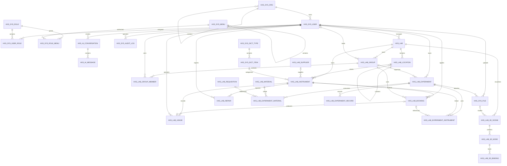

# HXS 实验室管理系统数据模型

本模型覆盖当前系统实际使用的系统管理、AI 推理、实验室基础数据、仪器、库存、实验记录和 3D 空间业务表。数据库字段以 Oracle 为准，领域实体位于 `HxsAiSystem.Domain/Entities`。本文最后同步于 2026-08-31。Navicat 逆向模型前应先执行全部增量脚本至 `15_add_lab_visualization.oracle.sql`。

## 模型分区

| 分区 | 表 | C# 模型 |
| --- | --- | --- |
| 系统管理 | `HXS_SYS_ORG`、`HXS_SYS_USER`、`HXS_SYS_ROLE`、`HXS_SYS_MENU`、两张授权关系表 | `SysOrg`、`AppUser`、`SysRole`、`SysMenu`、`SysUserRole`、`SysRoleMenu` |
| 系统支撑 | `HXS_SYS_AUDIT_LOG`、`HXS_SYS_FILE` | `SysAuditLog`、`SysFileRecord` |
| AI 推理 | `HXS_AI_CONVERSATION`、`HXS_AI_MESSAGE` | `AiConversation`、`AiMessage` |
| 基础数据 | `HXS_LAB`、位置、课题组、成员、供应商、字典类型及字典项 | `LabFoundationEntities.cs` 中的 7 个实体 |
| 仪器闭环 | 仪器、预约、使用、维修 | `LabInstrumentEntities.cs` 中的 4 个实体 |
| 库存闭环 | 物资、批次、流水、领用申请及明细 | `LabInventoryEntities.cs` 中的 5 个实体 |
| 实验记录 | 实验任务、仪器关联、物资关联及过程记录 | `LabExperimentEntities.cs` 中的 4 个实体，附件复用 `SysFileRecord` |
| 3D 空间 | 场景、空间/设备节点、节点业务绑定 | `Lab3dEntities.cs` 中的 `Lab3dScene`、`Lab3dNode`、`Lab3dBinding` |

`HXS_APP_USER` 是早期兼容表，当前认证统一使用 `HXS_SYS_USER`，因此不再创建第二套 C# 用户实体。

## 3D 空间模型

### `HXS_LAB_3D_SCENE`

| 字段 | 说明 |
| --- | --- |
| `ID` | 场景主键，`RAW(16)` |
| `LAB_ID` | 所属实验室 ID，外键关联 `HXS_LAB.ID` |
| `SCENE_NAME` | 场景名称 |
| `MODEL_URL` | 当前 GLB 模型的受控访问地址 |
| `MODEL_FILE_ID` | 当前启用模型文件，外键关联 `HXS_SYS_FILE.ID` |
| `VERSION` | 场景模型逻辑版本，上传或切换历史模型时递增 |
| `BACKGROUND_COLOR` | Three.js 场景背景色 |
| `IS_ACTIVE` | 是否启用 |
| `CREATE_TIME`、`UPDATE_TIME` | 创建和更新时间 |

### `HXS_LAB_3D_NODE`

| 字段 | 说明 |
| --- | --- |
| `ID` | 节点主键，`RAW(16)` |
| `SCENE_ID` | 所属场景，外键关联 `HXS_LAB_3D_SCENE.ID` |
| `NODE_CODE`、`NODE_NAME` | 节点编码和名称 |
| `NODE_TYPE` | 节点类型：`lab`、`location`、`instrument` |
| `POSITION_X/Y/Z` | 三维位置 |
| `SCALE_X/Y/Z` | 三维缩放 |
| `SORT_NO` | 展示顺序 |
| `CREATE_TIME`、`UPDATE_TIME` | 创建和更新时间 |

### `HXS_LAB_3D_BINDING`

| 字段 | 说明 |
| --- | --- |
| `ID` | 绑定主键，`RAW(16)` |
| `NODE_ID` | 所属节点，外键关联 `HXS_LAB_3D_NODE.ID` |
| `BUSINESS_TYPE` | 业务类型：`lab`、`location`、`instrument` |
| `BUSINESS_ID` | 被绑定的业务数据 ID |
| `CREATE_TIME`、`UPDATE_TIME` | 创建和更新时间 |

三张表可由 `database/15_add_lab_visualization.oracle.sql` 独立创建或升级，`LabVisualizationSchema` 同时负责老环境启动补列。场景到实验室、场景到当前模型文件、节点到场景、绑定到节点均为物理外键；模型历史文件通过 `HXS_SYS_FILE.BUSINESS_TYPE='lab-3d-model'` 和场景 ID 保留。

## 更新方式

1. 新增业务表时，在 `HxsAiSystem.Domain/Entities` 增加带 `SugarTable`、`SugarColumn` 的实体模型。
2. 在 `DatabaseDocumentationInitializer` 增加业务化中文名称；未登记的新表和字段也会得到兜底注释。
3. 同步更新本文件中的关系图。数据库详细字段、类型、主键和唯一键可通过 `database/model/generate_data_dictionary.oracle.sql` 从当前 Oracle 实例生成。

## Navicat 逆向模型

1. 在 Navicat 中连接 `HXS_AISYSTEM`，按顺序执行现有数据库增量脚本至 `15_add_lab_visualization.oracle.sql`。
2. 启动一次 API，使初始化器幂等同步菜单、角色权限和演示数据。
3. 选择“模型”并使用“从数据库逆向到模型”，连接当前 Oracle 数据库。
4. Schema 选择 `HXS_AISYSTEM`，勾选全部 `HXS_` 表并完成导入。
5. 模型中会按数据库外键自动生成系统、AI、实验室业务和 3D 场景关系线，包括实验室到场景、文件到场景、场景到节点、节点到绑定；表及字段中文说明来自 Oracle Comment。

外键使用 `ENABLE NOVALIDATE`，可以保留历史数据并约束后续写入。清理历史孤立数据后，可在 Navicat 或 Oracle 中将约束切换为 `ENABLE VALIDATE`。
